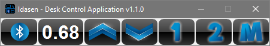

# idasen-ui

[Get latest version here!](https://github.com/danieldesrochers/idasen-ui/releases)

Idasen Desk control works with ikea IDÅSEN desk.

IDÅSEN is an electric sitting-standing desk with a Linak bluetooth controller sold by ikea.
The position of the desk can controlled by a physical switch on the desk or via bluetooth using an phone app.

This application controls the Idasen desk via bluetooth from a desktop computer and allows to store two favorite positions.

This application is built in Python on top of the IdasenDesk API made by 'newAM/idasen' which was a heavily modified fork of 'rhyst/idasen-controller'.

The Idasen desk control app (idasen-ui) has been package for Windows 10 for easier installation.

Prerequisites
=============
**The desk must be connected and paired to the computer before launching the application.**
- Open Windows Parameters
- Find your Bluetooth settings
- Put the IKEA Idasen desk in pairing mode (blue light will flash slowly)
- On the Bluetooth setting window, click "Add a Bluetooth device"
- Select "Desk 8638" and add it to your bluetooth devices

Install Idasen Desk Control
===========================
- Download latest release installer (https://github.com/danieldesrochers/idasen-ui/releases)

- Download and launch the latest installer (i.e.: idasen desk control v1.3.0.exe)

- Accept the license and choose your installation folder 

- A new 'Idasen Desk Control' shortcut will be created in Windows Start menu

How To Use Idasen Desk Control
==============================
Idasen Desk Control is a simple user interface to control your IKEA IDASEN desk.

Connect your desk
------------------
When application runs for the first time, no save configuration will be found. 
Be patient, it might take few minutes to explore all Bluetooth devices paired with the computer.
Click Bluetooth button to discover your desk and save initial configuration.

You are connected!
------------------
Once connected to the desk, current desk position will be displayed and moving buttons will be enabled. 
- Press and maintain the up/down arrow the move the desk to the desired position.
- Press M(emory) button to save the current position to 1 or 2.
- Press position 1 or 2 to move the desk to the save position.

Right-click on the Idasen Desk Control display to control the user interface
- Always on top
- Minimize to tray instead of taskbar

Known issues
============
IKEA IDASEN Desk internal Linak controller seems to have a built-in memory for previous positions. This could cause some weird move effects. The app will retry twice to move to the right direction. The built-in memory issue seems to reduce while using the application for a longer period since the previous built-in positions match those from the application.
